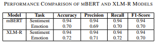

# Bengali Sentiment and Emotion Classification for Product Reviews

This project focuses on **Classifying Sentiment and Emotions** in **Bengali Product Reviews**. The goal is to build a model that can classify the sentiment (positive or negative) and emotion (happy, love, sadness, fear, anger) expressed in Bengali product reviews. The project uses **multi-task learning** to simultaneously predict sentiment and emotion from the same text.

## Table of Contents

1. [Introduction](#introduction)
2. [Dataset](#dataset)
3. [Data Preprocessing](#data-preprocessing)
4. [Model Creation](#model-creation)
5. [Training the Model](#training-the-model)
6. [Evaluation](#evaluation)
7. [Live Prediction](#live-prediction)
8. [Challenges & Solutions](#challenges-solutions)
9. [Requirements](#requirements)
10. [Usage](#usage)
11. [Basic Diagram](#Diagram)
12. [Load Model](#Load-Model)

## Introduction

This repository implements a solution for classifying **Bengali sentiment** and **emotion** from product reviews using pre-trained transformer models: **mBERT** (Multilingual BERT) and **XLM-RoBERTa**. We use **multi-task learning** to train the models to predict both sentiment **(binary classification: positive or negative)** and emotion **(multi-class classification: happy, love, sadness, fear, anger)**.

## Dataset

The dataset consists of Bengali product reviews, each containing:
- **Review Text**: The product review written in Bengali.
- **Sentiment**: The sentiment label (positive or negative).
- **Emotion**: The emotion expressed in the review (happy, love, sadness, fear, anger).

The dataset is split into **80% training** and **20% testing**.

## Data Preprocessing

The following preprocessing steps are applied to the dataset:

1. **Text Cleaning**:
   - Lowercasing all text.
   - Removing digits, special characters, and unnecessary punctuation.

2. **Language Detection**:
   - A language detection library is used to ensure all text is in Bengali or English

3. **Tokenization**:
   - Text is tokenized using **mBERT** and **XLM-RoBERTa** tokenizers.

4. **Label Encoding**:
   - Sentiment labels (positive/negative) are encoded into numerical labels.
```bash
      0: Negative,
      1: Positive  
```

   - Emotion labels (happy, love, sadness, fear, anger) are also encoded into numerical labels.
```bash
      0: 'Anger',
      1: 'Fear',
      2: 'Happy',
      3: 'Love',
      4: 'Sadness' 
```

5. **Data Splitting**:
   - The dataset is split into training (80%) and testing (20%) sets using **train_test_split**.

## Model Creation

We use pre-trained transformer models for the classification task:

- **mBERT**: A multilingual version of BERT capable of handling Bengali text.
- **XLM-RoBERTa**: A robust multilingual model, also effective for Bengali text.

### Multi-task Learning
The model is fine-tuned for **multi-task learning**, where it learns to predict:
- **Sentiment**: Binary classification (positive or negative).
- **Emotion**: Multi-class classification (happy, love, sadness, fear, anger).

Two separate output heads are added to the base model:
- One for **sentiment classification** (2 classes).
- One for **emotion classification** (5 classes).

## Training the Model

The model is trained with the following settings:

- **Optimizer**: AdamW, which is well-suited for fine-tuning transformer models.
- **Loss Function**: Cross-Entropy Loss, appropriate for classification tasks.
- **Training Epochs**: The model is trained for **5 epochs**.
- **Learning Rate**: **1e-5** (can be adjusted as needed).

The model is trained using **GPU acceleration** to speed up the process.

## Evaluation

After training, the model is evaluated on the test dataset using the following metrics:

- **Accuracy**: The percentage of correct predictions.
- **Precision**: The proportion of true positives over all positive predictions.
- **Recall**: The proportion of true positives over all actual positive instances.
- **F1-score**: The harmonic mean of precision and recall.

   

The evaluation is performed for both **sentiment** and **emotion** tasks.

## Live Prediction

Once the model is trained, it can be used for live prediction:

1. **Input**: A product review written in Bengali.
2. **Prediction**: The model predicts:
   - **Sentiment**: Whether the review is positive or negative.
   - **Emotion**: The emotion expressed in the review (happy, love, sadness, fear, or anger).

The input text is tokenized, passed through the trained model, and the predicted labels are decoded back into their respective sentiment and emotion classes.

## Challenges & Solutions

1. **Imbalanced Dataset**:
   - If the dataset is imbalanced (e.g., more positive than negative reviews), we handle it using:
     - **Class weights** in the loss function.
     - **Oversampling** or **undersampling** techniques.

2. **Training Time**:
   - Training the models for multiple epochs can be time-consuming, so **GPU acceleration** is used to speed up the training process.

## Requirements

To run the code, you will need the following libraries:

- `torch` (PyTorch)
- `transformers` (Hugging Face)
- `sklearn`
- `datasets`
- `pandas`
- `numpy`
- `langdetect`
- `tqdm`

## Usage

- Clone the repository

```bash
git clone https://github.com/Soumyo001/Sentiment-analysis-on-Bengali-Product-Reviews.git
cd Sentiment-analysis-on-Bengali-Product-Reviews
```

- Create python virtual environment
```bash
python3 -m venv ./venv
./venv/Scripts/activate
```
***make sure you have python3 installed***

- Install the required dependencies:

```bash
pip install -r requirements.txt
```

## Diagram
```bash
  +-------------------+       +----------------------+         +--------------------------+
  |  Data Collection  |  ---> |  Data Preprocessing  | ------> |  Tokenization & Encoding |
  +-------------------+       +----------------------+         +--------------------------+
         |                           |                                   |
         v                           v                                   v
  +-------------------+      +------------------+              +-----------------------------+
  | Language Detection|      | Train-Test Split |              |Label Encoding for Sentiment |
  +-------------------+      +------------------+              +-----------------------------+
         |                           |                                   |
         v                           v                                   v
  +---------------------+      +------------------------+      +------------------------------+
  |  Model Creation     | ---> |  Model Training        | ---> | Model Evaluation             |
  | (mBERT, XLM-R)      |      | (AdamW optimizer)      |      | (Accuracy, Precision, Recall)|
  +---------------------+      +------------------------+      +------------------------------+
                                      |
                                      v
                           +-----------------------+
                           |   Live Prediction     |
                           | (Sentiment & Emotion) |
                           +-----------------------+
```

## Load-Model
- Install the Required Dependencies :
```bash
pip install -r requirements.txt
```
- Download the zip file from [this link](https://drive.google.com/file/d/1DtHTlJLlueYPo4fxN0-XJ6E2WFGw4uSy/view?usp=drive_link) and extract it :

   - for windows :
   ```powershell
   Expand-Archive -Path trained_sentiment_and_emotion_classification.zip -DestinationPath <your-project-directory>
   ```
   - for linux :
   ```bash
   unzip trained_sentiment_and_emotion_classification.zip -d /project/directory
   ```
- Run **load_model.py** script :
```bash
python3 load_model.py
```

## License
This project is licensed under the MIT License - see the [LICENSE](LICENSE) file for details.

